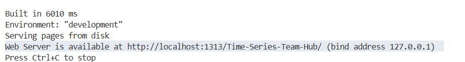

# Chào mừng đến với Team Hub!

Hub này là nơi lưu trữ trung tâm cho tất cả bài blog, dự án, và cuộc họp nhóm. Các nội dung sẽ được sắp xếp trong các thư mục riêng biệt, mỗi thư mục sẽ phục vụ cho một mục đích cụ thể.

Để đảm bảo việc quản lý hub được nhất quán và hiệu quả, vui lòng làm theo các hướng dẫn dưới đây một cách cẩn thận:<br/>

## I/ Cấu trúc folder:  
> 1. Folder - Blog and Project <br/>
>> 1.1. Folder - W1
>>> File - Blog notes
>>> File - Projects 

>> 1.2. Folder - W2 <br/>
>> ...

> 2. Folder - Team briefing <br/>
>> File - Meeting briefing 05.28.2025
>> ... <br/>

> 3. Folder - Competition <br/>
>> Folder - Competition Name  

> 4. Folder - Reference
>> File/Link - Reference/Papers

## II/ Các deadline quan trọng:
### Đối với việc viết blog sau mỗi tuần học: 
- Thứ 3 tiếp theo sau tuần học, hai bạn chịu trách nhiệm cho blog sẽ cần gửi bảng nháp bằng file word để team review
- Thứ 6 sẽ gửi bảng cuối cùng bằng file latex dựa trên góp ý thành viên trong nhóm trước khi nộp cho ad/TA
- ! Deadline của chương trình: Thứ 7 sau mỗi tuần, thời gian STA kiểm tra các blog của nhóm <br/>
*Ví dụ: W1 kết thúc ngày học vào 08/06 thì vào 17/06 cần có bảng nháp đầu tiên, 20/6 cần bảng cuối và nộp cho ad/TA.*

### Đối với project sau mỗi module
- Thứ 6 của tuần cuối của module, các thành viên trong nhóm cần phải có code cho dự án của mình, cùng chia sẻ cách làm và chọn ra bài nào hay để nộp cho ad/TA
- ! Deadline của chương trình: Ngày thứ 7 sau khi kết thúc 1 module

### Đối với việc họp team định kỳ mỗi tuần:
- Team họp định kỳ vào mỗi T6 (09h tối US) - T7 (09h sáng VN) để cùng nhau review kiến thức, share note của mình trong tuần, và cùng nhau đồng thuận cho các kế hoạch sắp tới. 
- Mỗi tuần sẽ có một người chịu trách nhiệm dẫn dắt cuộc họp, một người khác chịu trách nhiệm note điểm quan trọng team meeting, và lưu tại folder - Team briefing

## III/ Thành viên chịu trách nhiệm viết blog của mỗi tuần học:
- W1: Hà + Thành
- W2: Linh + Tùng
- W3: Phương + Huân
- ... Thứ tự sẽ được tiếp tục lặp lại tương tự như W1 - W9 cho các tuần tiếp theo 

# IV/ Cách để push nội dung lên website:
**Bước 1**: Tạo file index.md (Readme của tuần) và lưu lại tại folder `content/posts/2025/Week <xxx>`. Trong trường hợp nội dung khác không phải blog tuần thì miễn sao file `index.md` ở tại folder `content/posts` là được. <br/>
**Bước 2**: Lưu file pdf tóm tắt buổi học tại vị trí `assets/pdf` Và để nhúng file pdf vào file `index.md`, thì tại phần Tài liệu đính kèm phải được lập trình theo mẫu syntax sau: 

```bash
 
```
**Bước 3**: Cách chạy hugo server để xem trước website tại máy trước khi đưa file lên github. 
```bash
sudo snap install hugo
hugo server
```
Tại terminal, bấm vào đường dẫn tại phần Web Server để xem webpage. 


**Note:** Chrome web browser sẽ cache trang web nên nếu có những thay đổi thì phải force refresh bằng cách Ctrl + Shift + R